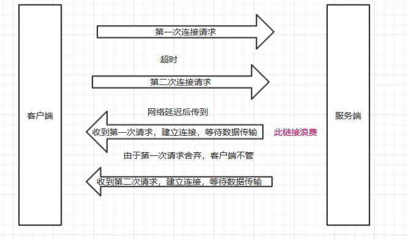
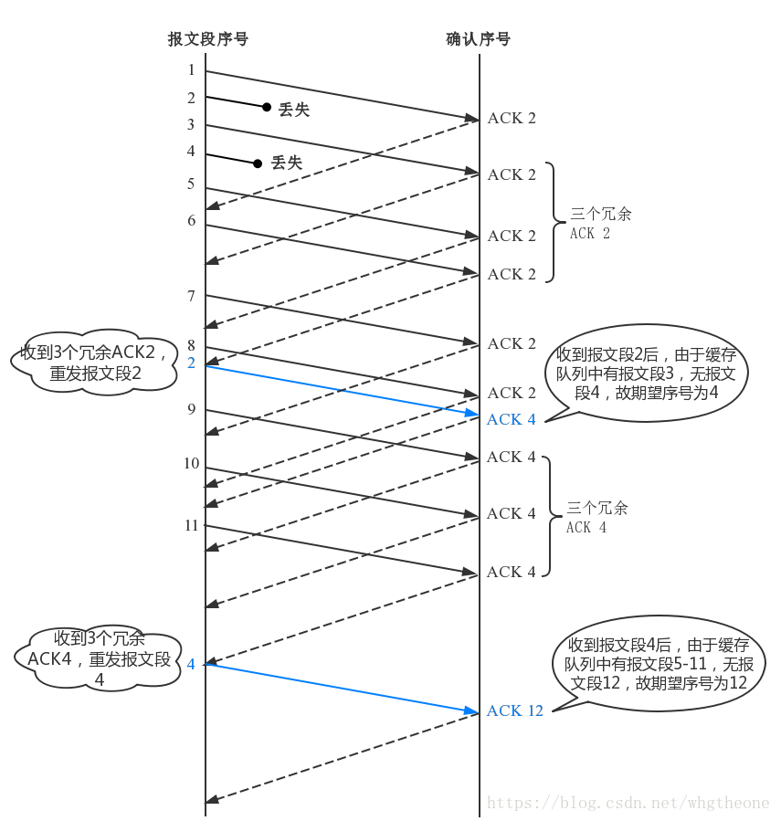

## 计算机网络知识点

### 冯诺依曼体系结构

1.存储器用来存放数据和程序  
2.运算器主要运行算数运算和逻辑运算，并将中间结果暂存到运算器中  
3.控制器主要用来控制和指挥程序和数据的输入运行，以及处理运算结果  
4.输入设备用来将人们熟悉的信息形式转换为机器能够识别的信息形式，常见的有键盘，鼠标等  
5.输出设备可以将机器运算结果转换为人们熟悉的信息形式，如打印机输出，显示器输出等

### OSI 7层模型

OSI（Open System Interconnect），即开放式系统互联；

OSI模型与TCP模型的对应关系：

### TCP 5层模型

* 物理层：传输比特流；各种接口规格限定
* 数据链路层：将数据装成帧（差错控制）；以太网、局域网等
* 网络层：将一端的数据传到另一端；ip协议
* 传输层：将报文进程之间传递；tcp，udp协议
* 应用层：高层应用协议，应用都依据一个协议实现沟通交流；ftp smtp http等

### tcp三次握手

  
第一次握手：建立连接时，客户端发送syn包(syn=j)到服务器，并进入SYN_SEND状态，等待服务器确认；  
第二次握手：服务器收到syn包，必须确认客户的SYN（ack=j+1），同时自己也发送一个SYN包（syn=k），即SYN+ACK包，此时服务器进入SYN_RECV状态；  
第三次握手：客户端收到服务器的SYN＋ACK包，向服务器发送确认包ACK(ack=k+1)，此包发送完毕，客户端和服务器进入ESTABLISHED状态，完成三次握手。  
完成三次握手，客户端与服务器开始传送数据

### tcp四次挥手

  
1客户端先发送FIN，进入FIN_WAIT1状态  
2服务端收到FIN，发送ACK，进入CLOSE_WAIT状态，客户端收到这个ACK，进入FIN_WAIT2状态  
3服务端发送FIN，进入LAST_ACK状态 4客户端收到FIN，发送ACK，进入TIME_WAIT状态，服务端收到ACK，进入CLOSE状态  
TIME_WAIT的状态就是主动断开的一方（这里是客户端），发送完最后一次ACK之后进入的状态。并且持续时间还挺长的。客户端TIME_WAIT持续2倍MSL时长，在linux体系中大概是60s，转换成CLOSE状态  
***TIME_WAIT***  
TIME_WAIT 是主动关闭链接时形成的，等待2MSL时间，约4分钟。主要是防止最后一个ACK丢失。 由于TIME_WAIT 的时间会非常长，因此server端应尽量减少主动关闭连接  
***CLOSE_WAIT***  
CLOSE_WAIT是被动关闭连接是形成的。根据TCP状态机，服务器端收到客户端发送的FIN，则按照TCP实现发送ACK，因此进入CLOSE_WAIT状态。但如果服务器端不执行close()
，就不能由CLOSE_WAIT迁移到LAST_ACK，则系统中会存在很多CLOSE_WAIT状态的连接。此时，可能是系统忙于处理读、写操作，而未将已收到FIN的连接，进行close。此时，recv/read已收到FIN的连接socket，会返回0。  
***为什么需要 TIME_WAIT 状态？***  
可靠的关闭TCP连接。在主动关闭方发送的最后一个 ack(fin) ，有可能丢失，这时被动方会重新发fin, 如果这时主动方处于 CLOSED 状态 ，就会响应 rst 而不是 ack。所以主动方要处于 TIME_WAIT 状态，而不能是
CLOSED 。  
***为什么 TIME_WAIT 状态需要保持 2MSL 这么长的时间？***  
防止上一次连接中的包，迷路后重新出现，影响新连接（经过2MSL，上一次连接中所有的重复包都会消失）  
***TIME_WAIT 和CLOSE_WAIT状态socket过多***  
如果服务器出了异常，百分之八九十都是下面两种情况：  
1.服务器保持了大量TIME_WAIT状态  
2.服务器保持了大量CLOSE_WAIT状态，简单来说CLOSE_WAIT数目过大是由于被动关闭连接处理不当导致的。

### 为什么tcp要三次握手而不是两次

采用三次握手是：为了防止失效的连接请求报文段突然又传送到主机 B ，因而产生错误(浪费资源，连接浪费)。  
图示：

### 为什么tcp要四次挥手

这是因为服务端的LISTEN状态下的SOCKET当收到SYN报文的建连请求后，它可以把ACK和SYN（ACK起应答作用，而SYN起同步作用）放在一个报文里来发送。但关闭连接时，当收到对方的FIN报文通知时，它仅仅表示对方没有数据发送给你了；但未必你所有的数据都全部发送给对方了，所以你可以未必会马上会关闭SOCKET,也即你可能还需要发送一些数据给对方之后，再发送FIN报文给对方来表示你同意现在可以关闭连接了，所以它这里的ACK报文和FIN报文多数情况下都是分开发送的。

### 流量控制和拥塞控制

* 流量控制：所谓的流量控制就是让发送方的发送速率不要太快，让接收方来得及接受。利用滑动窗口机制可以很方便的在TCP连接上实现对发送方的流量控制。TCP的窗口单位是字节，不是报文段，发送方的发送窗口不能超过接收方给出的接收窗口的数值。
* 拥塞控制：所谓拥塞控制就是防止过多的数据注入到网络中，这样可以使网络中的路由器或链路不致过载。拥塞控制所要做的都有一个前提，就是网络能承受现有的网络负荷。

### 拥塞控制算法

* 慢启动：窗口数从1开始指数增加，直到门限值，采用拥塞避免算法。
* 拥塞避免算法：窗口数从门限值每次加一直到网络拥塞。
* 快恢复算法：如果网络拥塞，那么门限值减到一半，窗口数从门限值采用拥塞避免算法增加。  
  
* 快重传：对每一个数据报都回应ask，当多次收到某个回应，就发送这个数据报，不用等超时。
  

### 滑动窗口协议

过程模拟p1-p3代表滑动窗口的边缘，即窗口大小，p2指向最后发送数据的下一个（待发位置）    
1 发送方发送31-35个位置的数据，p1指向31，p2指向36  
2 发送方发送36-41个位置的数据，p1指向31，p2指向42  
3 接收方收到31-35，返回ask为36，接收窗口往右移动5位 4 接收方p1指向36，p2指向42不变，p3指向56（往右移动5位）

### http协议

1）HTTP是一个无状态协议，为应用层协议，基于TCP/IP之上。  
2）HTTP的一个工作过程分为：地址解析、封装HTTP请求数据包、通过TCP建立连接、客户端发送请求指令、服务器响应、服务器关闭连接。 请求由请求行、请求头和请求正文组成。  
响应由状态行、消息报头和响应正文组成。

#### cookies安全的

* secure：表示创建的 Cookie 会被以安全的形式向服务器传输，也就是只能在 HTTPS 连接中被浏览器传递到服务器端进行会话验证，如果是 HTTP 连接则不会传递该信息，所以不会被窃取到Cookie 的具体内容。
* HttpOnly=true：cookie不能被js获取到，无法用document.cookie打出cookie的内容

### http 1.0 / 1.1 / 2.0的区别

* 1.0: 链接无法复用，即不支持持久链接;请求队列的第一个请求因为服务器正忙（或请求格式问题等其他原因），导致后面的请求被阻塞。
* 1.1: 支持持久链接
* 2.0: 支持多路复用

### HTTPS

我们都知道HTTPS能够加密信息，以免敏感信息被第三方获取，所以很多银行网站或电子邮箱等等安全级别较高的服务都会采用HTTPS协议。  

### UDP协议

面向数据报的传输协议，结构：原端口、目标端口、长度、检验和、数据  
检验和检验:按照一定规则划分为几组数据，不断求异或操作得到的一组值

### UDP和TCP的区别

1.基于连接与无连接；  
2.对系统资源的要求（TCP较多，UDP少）；  
3.UDP程序结构较简单；  
4.TCP保证数据正确性，UDP可能丢包，TCP保证数据顺序，UDP不保证。

### ping原理

ICMP报文：

* 源mac地址
* 目标mac地址
* 源ip
* 目标ip

同网段：192.168.0.1（主机1） ping 192.168.0.2（主机2）  
主机1如果没有ip的mac地址缓存，则向同网段发送ARP广播包，如果有对应ip的主机则相应自己的mac地址， 然后向目的主机发送ICMP报文，目的主机再同样的方式响应回来  
不同网段：  
主机在同网段没找到ip对应地址，则将目的mac地址设置成网关的mac地址，让网关转发，网关发现下一跳接口能访问目的主机，
将源mac地址改为下一跳mac地址，目的mac地址改为最终主机mac地址，同时都学习到了mac地址，然后回传的时候也是一样。

### TCP状态机

* CLOSED 状态时初始状态。
* LISTEN 服务端运行起来监听
* SYNRECVD:服务器端收到SYN后，状态为SYN；发送SYN ACK;
* SYN_SENTY:应用程序发送SYN后，状态为SYN_SENT
* ESTABLISHED:SYNRECVD收到ACK后，状态为ESTABLISHED； SYN_SENT在收到SYN ACK，发送ACK，状态为ESTABLISHED；
* CLOSE_WAIT:服务器端在收到FIN后
* TIME_WAIT:主动关闭的一方

客户端转换：close -> synsend -> establish -> fin-wait1 -> fin-wait2 -> timewait -> close  
服务端转换：close -> listen -> synrecv -> establish -> close-wait -> last-ack -> close
