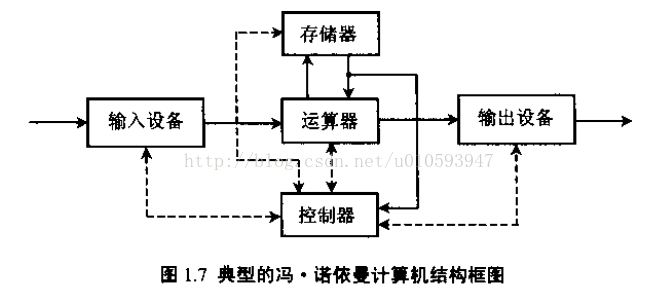
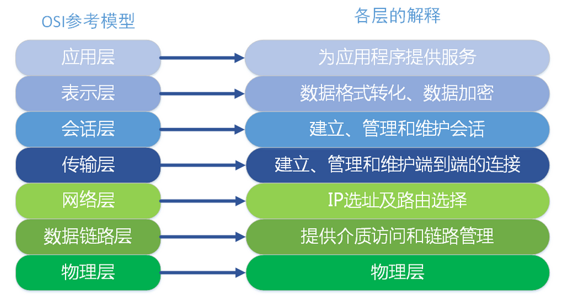
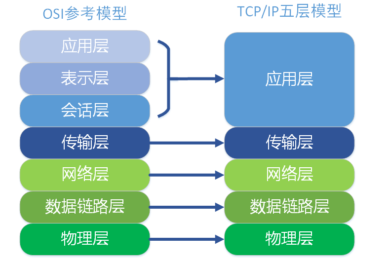

## 计算机网络知识点 
### 冯诺依曼体系结构

1.存储器用来存放数据和程序  
2.运算器主要运行算数运算和逻辑运算，并将中间结果暂存到运算器中  
3.控制器主要用来控制和指挥程序和数据的输入运行，以及处理运算结果  
4.输入设备用来将人们熟悉的信息形式转换为机器能够识别的信息形式，常见的有键盘，鼠标等  
5.输出设备可以将机器运算结果转换为人们熟悉的信息形式，如打印机输出，显示器输出等  
### OSI 7层模型
OSI（Open System Interconnect），即开放式系统互联；

OSI模型与TCP模型的对应关系：

### TCP 5层模型
* 物理层：传输比特流
* 数据链路层：将数据装成帧（差错控制）
* 网络层：将一端的数据传到另一端
* 传输层：将报文进程之间传递
* 应用层：高层应用协议，应用都依据一个协议实现沟通交流
### tcp三次握手
第一次握手：建立连接时，客户端发送syn包(syn=j)到服务器，并进入SYN_SEND状态，等待服务器确认；  
第二次握手：服务器收到syn包，必须确认客户的SYN（ack=j+1），同时自己也发送一个SYN包（syn=k），即SYN+ACK包，此时服务器进入SYN_RECV状态；  
第三次握手：客户端收到服务器的SYN＋ACK包，向服务器发送确认包ACK(ack=k+1)，此包发送完毕，客户端和服务器进入ESTABLISHED状态，完成三次握手。  
完成三次握手，客户端与服务器开始传送数据
### tcp四次挥手
1客户端先发送FIN，进入FIN_WAIT1状态  
2服务端收到FIN，发送ACK，进入CLOSE_WAIT状态，客户端收到这个ACK，进入FIN_WAIT2状态  
3服务端发送FIN，进入LAST_ACK状态 
4客户端收到FIN，发送ACK，进入TIME_WAIT状态，服务端收到ACK，进入CLOSE状态  
TIME_WAIT的状态就是主动断开的一方（这里是客户端），发送完最后一次ACK之后进入的状态。并且持续时间还挺长的。客户端TIME_WAIT持续2倍MSL时长，在linux体系中大概是60s，转换成CLOSE状态  
  ***TIME_WAIT***  
TIME_WAIT 是主动关闭链接时形成的，等待2MSL时间，约4分钟。主要是防止最后一个ACK丢失。 由于TIME_WAIT 的时间会非常长，因此server端应尽量减少主动关闭连接  
  ***CLOSE_WAIT***  
CLOSE_WAIT是被动关闭连接是形成的。根据TCP状态机，服务器端收到客户端发送的FIN，则按照TCP实现发送ACK，因此进入CLOSE_WAIT状态。但如果服务器端不执行close()，就不能由CLOSE_WAIT迁移到LAST_ACK，则系统中会存在很多CLOSE_WAIT状态的连接。此时，可能是系统忙于处理读、写操作，而未将已收到FIN的连接，进行close。此时，recv/read已收到FIN的连接socket，会返回0。  
  ***为什么需要 TIME_WAIT 状态？***  
假设最终的ACK丢失，server将重发FIN，client必须维护TCP状态信息以便可以重发最终的ACK，否则会发送RST，结果server认为发生错误。TCP实现必须可靠地终止连接的两个方向(全双工关闭)，client必须进入 TIME_WAIT 状态，因为client可能面 临重发最终ACK的情形。  
  ***为什么 TIME_WAIT 状态需要保持 2MSL 这么长的时间？***  
如果 TIME_WAIT 状态保持时间不足够长(比如小于2MSL)，第一个连接就正常终止了。第二个拥有相同相关五元组的连接出现，而第一个连接的重复报文到达，干扰了第二个连接。TCP实现必须防止某个连接的重复报文在连接终止后出现，所以让TIME_WAIT状态保持时间足够长(2MSL)，连接相应方向上的TCP报文要么完全响应完毕，要么被 丢弃。建立第二个连接的时候，不会混淆。  
  ***TIME_WAIT 和CLOSE_WAIT状态socket过多***  
如果服务器出了异常，百分之八九十都是下面两种情况：  
1.服务器保持了大量TIME_WAIT状态  
2.服务器保持了大量CLOSE_WAIT状态，简单来说CLOSE_WAIT数目过大是由于被动关闭连接处理不当导致的。   
### 流量控制和拥塞控制
 * 流量控制：所谓的流量控制就是让发送方的发送速率不要太快，让接收方来得及接受。利用滑动窗口机制可以很方便的在TCP连接上实现对发送方的流量控制。TCP的窗口单位是字节，不是报文段，发送方的发送窗口不能超过接收方给出的接收窗口的数值。
 * 拥塞控制：所谓拥塞控制就是防止过多的数据注入到网络中，这样可以使网络中的路由器或链路不致过载。拥塞控制所要做的都有一个前提，就是网络能承受现有的网络负荷。
### 滑动窗口协议  

过程模拟p1-p3代表滑动窗口的边缘，即窗口大小，p2指向最后发送数据的下一个（待发位置）    
1 发送方发送31-35个位置的数据，p1指向31，p2指向36  
2 发送方发送36-41个位置的数据，p1指向31，p2指向42  
3 接收方收到31-35，返回ask为36，接收窗口往右移动5位
4 接收方p1指向36，p2指向42不变，p3指向56（往右移动5位）  
### http协议 
1）HTTP是一个无状态协议，为应用层协议，基于TCP/IP之上。  
2）HTTP的一个工作过程分为：地址解析、封装HTTP请求数据包、通过TCP建立连接、客户端发送请求指令、服务器响应、服务器关闭连接。
请求由请求行、请求头和请求正文组成。  
响应由状态行、消息报头和响应正文组成。  