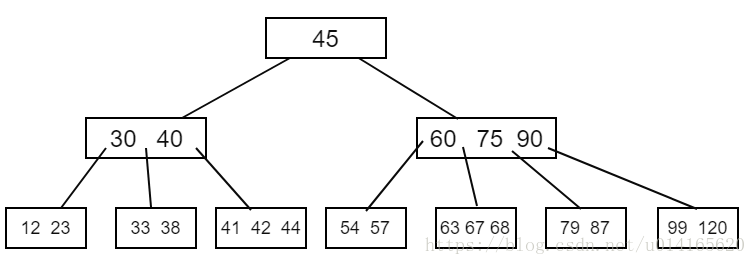
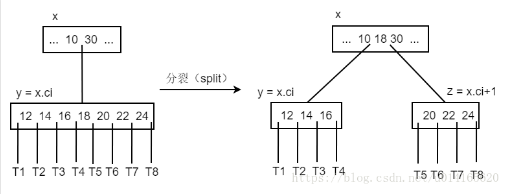
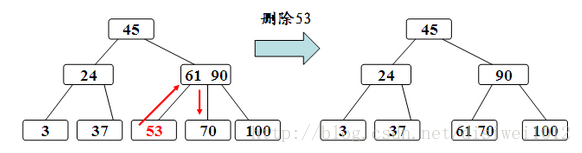
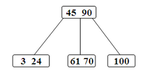

### B树

B树是一种平衡的多分树，通常我们说m阶的B树，它必须满足如下条件：

* 每个结点至多有m个子结点；
* 除根结点和叶结点外，其它每个结点至少有ceil(m/2)个子结点；
* 根结点至少有两个子结点；（唯一例外的是根结点就是叶子结点）
* 所有的叶结点在同一层；
* 有k个子结点的非根结点恰好包含k-1个关键码，关键码按照递增次序进行排列。

* 查询

~~~
B-Tree_Search(x, k)
	i = 1
	//找出最小下标 i ，使得 x.key[i] >= k
	while i <= x.n && x.key[i] < k                  
		i = i + 1
	//检查是否找到该关键字，找到则返回，否则后面结束此次查找
	if i <= x.n && k == x.key[i]
		return (x, i)
	else if x.leaf
		return null
	else DISK-READ(x, c[i])
		return B-Tree_Search(x.c[i], k)
~~~

插入：

* 自上而下查找插入叶结点位置；
* 如果插入的自下而上分裂满结点，如果叶子节点满度，达到2t-1  
    
  删除：核心思想还是删除叶子节点
* 叶子节点
    * 当前节点的key数量不是最低 -> 直接删除
    * 当前节点的key数量已是最低
        * 如果有右兄弟 -> 父节点合并到右兄弟（满度就再分割）
        * 如果没右兄弟 -> 则合并到左兄弟结点中（满度就再分割）
* 如果是非叶子节点
    * 找到后继叶子节点，交换位置，删除叶子节点

    
查询效率：logm(n)

### B+树

定义：

* 则除了根之外的每个节点都包含最少m/2个元素最多m-1个元素
* 对于所有内部节点，子节点的数目总是比元素的数目多一个
* 所有中间节点key都在叶子节点中,左边界或者右边界
* 所有的叶子节点是链接起来的  
    
  插入：
* 如果没有满度 -> 直接插入
* 如果满度 -> 分割将中间元素的key复制到父节点 删除：
* 如果当前节点不是最低值 -> 直接删除
* 如果当前节点已是最低值
    * 左兄弟有富余，移过来，更新父节点的key为所借的key
    * 左兄弟没有富余(包括没有左兄弟)删除节点和索引key

  
  
  
  
  
  
B+树的优势：

* 单一节点存储更多的元素，使得查询的IO次数更少。
* 所有查询都要查找到叶子节点，查询性能稳定。
* 所有叶子节点形成有序链表，便于范围查询。

查询效率：logm(n)

### 二叉树

定义：每个节点都最多有孩子，查找效率（log2(n)）

#### 特殊二叉树

* 完全二叉树：除了最后一层外，所有的节点都是满的，且最底层是从左到右排放
* 满二叉树：除了最后一层所有节点都有两个节点，最后一层无孩子
* 平衡二叉树：左右子树的高度绝对值不超过1

### 红黑树

* 每个节点要么是红要么是黑
* 根节点是黑色的
* 所有叶子节点都是黑色的空节点
* 红色节点的子节点必须是两个黑色节点
* 每个节点中所有到叶子节点的黑色节点数相等

查找效率：log2(n)

### 动态规划

大问题的最优解依赖于小问题的最优解。dp[i] = dp[i - 5] + n;  
解决步骤：

1. 根据题意写出状态转移方程式，如：dp[i][j] = min(dp[i][k] + dp[k][j], dp[i][j])，其中i < k < j
2. 分析各层循环的下标移动方向：  
   如上述方程式：由于dp[i][j]需要知道dp[i][k],dp[k][j]  
   分析i的移动方向：如果i是从小到大，那么在解决dp[i][j]的时候dp[k][j]肯定是不知道的，因为k > i,所以i方向是从大到小，此时解决到dp[i][j]的时候已经解决了dp[k][j]了  
   分析j的移动方向：如果j是从大到小，那么在解决dp[i][j]的时候dp[i][k]肯定是不知道的，因为k < j,所以j方向是从小到大，此时解决到dp[i][j]的时候已经解决了dp[i][k]了
3. 综上：

~~~ c
for (int i = len - 1; i >= 0; i++) {
    for (int j = i + 1; j < len; j++) {
        dp[i][j] = dp[i + 1][j] + 1;
        for (int k = i + 1; k < j; k++) {
            dp[i][j] = min(dp[i][j], dp[i][k] + dp[k][j]);
        }
    }
}
~~~

### 贪心算法

确保当前的做法是最优的，那么能保证最后的解是最优的

### 排序算法

* 冒泡：每次循环确定最大值 n²
* 归并：先分，排好序后再合 nlogn
* 快排：每次确定一个位置的元素，在递归排序前后阶段 nlogn
* 堆排序：每次确定最大的元素，和最后的替换，再下树 nlogn
    * 建堆过程：从最后的父节点开始下树 nlogn/2
* 插入：每次选定当前点插入到已经有序的列表里 n²
* 希尔排序：不断缩小间距的插入排序 *
* 桶排：先分成小桶，排好序之后，统一起来 *
* 计数排序：对数据进行计数，输出时从小到大 *

### 雪花算法

SnowFlake 算法，是 Twitter 开源的分布式 id 生成算法。其核心思想就是：使用一个 64 bit 的 long 型的数字作为全局唯一 id。在分布式系统中的应用十分广泛，且ID 引入了时间戳，基本上保持自增的，格式：

* 第一个部分，是 1 个 bit：0，这个是无意义的。符号位，1 代表正数
* 第二个部分是 41 个 bit：表示的是时间戳。
* 第三个部分是 5 个 bit：表示的是机房 id，10001。
* 第四个部分是 5 个 bit：表示的是机器 id，1 1001。
* 第五个部分是 12 个 bit：表示的序号，就是某个机房某台机器上这一毫秒内同时生成的 id 的序号，0000 00000000。

### 单源最短路径 - dijkstra

贪心策略：每一步都选择最优的点

* 获取距离最短的点，标记为确定
* 更新这个点能访问的点

### 多源最短路径 - floyd

动态规划

~~~ java
for (int k = 0; k < n; k++) 
    for (int i = 0; i < n; i++) 
        for (int j = 0; j < n; j++) 
            dist[i][j] = min(dist[i][j], dist[i][k] + dist[k][j])
~~~

### 最小生成树

原理：如果存在两个子树间存在一个最短边，则这个路径必然是最小生成树的一条边

#### prim 算法

* 源点 set，初始化只有一个点
* 查找set 到其他点的最短边
* 加入点到set，保存边
* 重复 2,3

#### Kruskal 算法

可使用并查集来判断/合并子树

* 按照边从小到大排序
* 若两个点属于两个子树，则保存边，合并两个子树
* 直到生成一个树