## 设计模式
* [创建型模式（5种）](README.md#结构型模式)：工厂方法模式，抽象工厂模式，单例模式，建造者模式，原型模式。
* [结构型模式（7种）](README.md#结构型模式)：适配器模式，装饰器模式，代理模式，外观模式，桥接模式，组合模式，享元模式。
* [行为型模式（11种）](README.md#行为型模式)：策略模式、模板方法模式、观察者模式、迭代器模式、责任链模式、命令模式、备忘录模式、状态模式、访问者模式、中介者模式、解释器模式。
### 创建型模式
* 工厂方法模式：工厂方法模式中是一个子类对应一个工厂类，而这些工厂类都实现于一个抽象接口。  
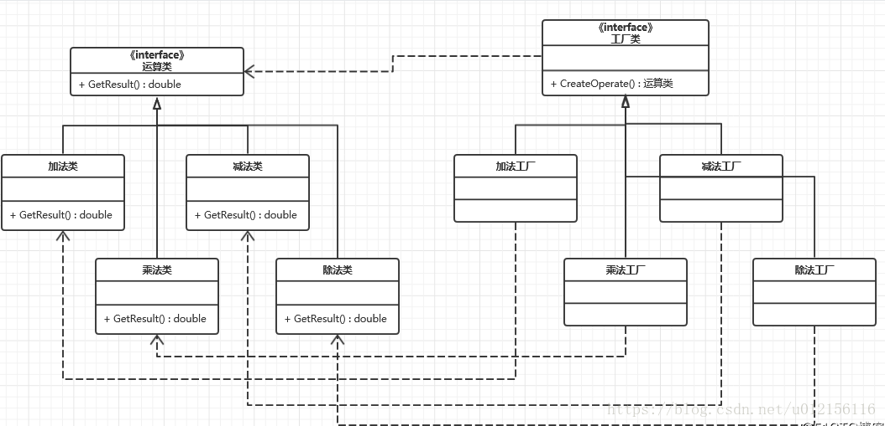  
步骤为：拿到具体工厂类 =\> 拿到具体对象
* 抽象工厂模式：当有多个抽象角色时，使用的一种工厂模式。  
  
步骤为：拿到具体大抽象工厂 =\> 拿到子工厂类 =\> 拿到具体对象
* 单例模式(双重检测模式)
~~~
public class Singleton {
	private static Singleton singleton;
	static Singleton getInstance(){
		if (singleton == null) {
			synchronized(Singleton.class) {
				if (singleton == null) {
					singleton = new Singleton();
				}
			}
		}
		return singleton;
	}
}
~~~
* 建造者模式：在生成多成员的类中可以实现随机组装成员  
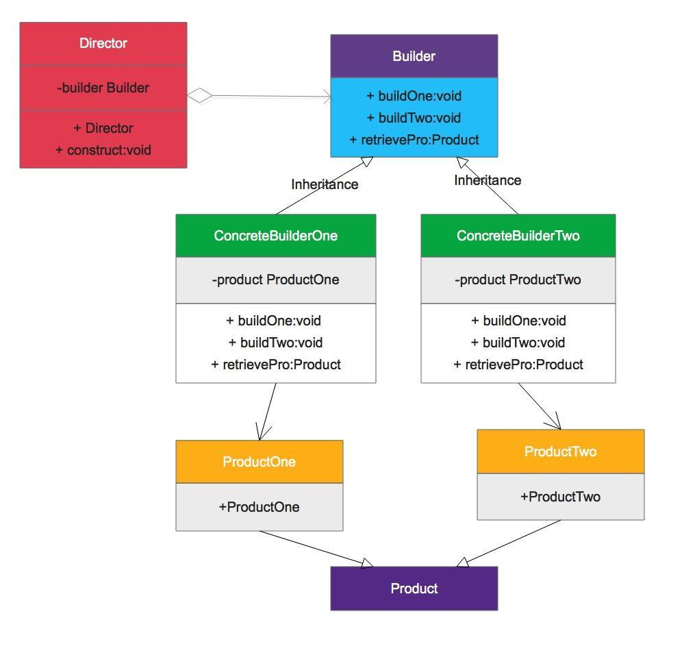  
* 原型模式：生成克隆对象，适用重新生成相同对象成本大的场景
### 结构型模式
* 适配器模式：对于不能直接调用的场景，像做了一个代理，转发调用  
例子：读卡器是作为内存卡和笔记本之间的适配器。您将内存卡插入读卡器，再将读卡器插入笔记本，这样就可以通过笔记本来读取内存卡。
* 装饰器模式：就是对已经存在的某些类进行装饰，以此来扩展一些功能
* 代理模式：包装一个类，转发请求
* 外观模式：为子系统中的一组接口提供一个一致的界面，外观模式定义了一个高层接口，这个接口使得这一子系统更加容易使用。整合所有子系统
* 桥接模式：将类的功能层次结构和实现层次结构相分离  
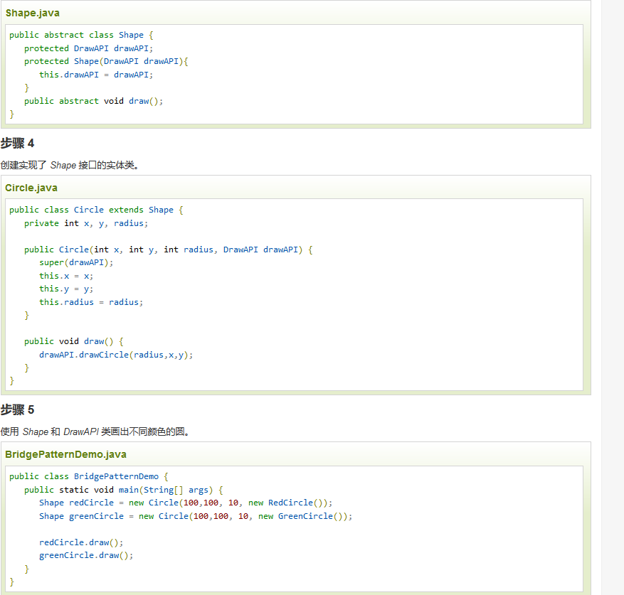  
* 组合模式：对象包含对象的问题，通过组合的方式（在对象内部引用对象）来进行布局
* 享元模式：主要用于减少创建对象的数量  
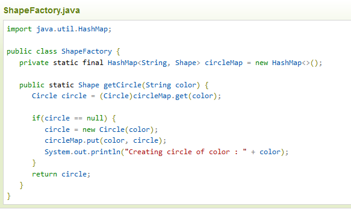  
### 行为型模式
* 策略模式：定义具体实施代码逻辑，通过外部传参的方式实现不同执行逻辑  
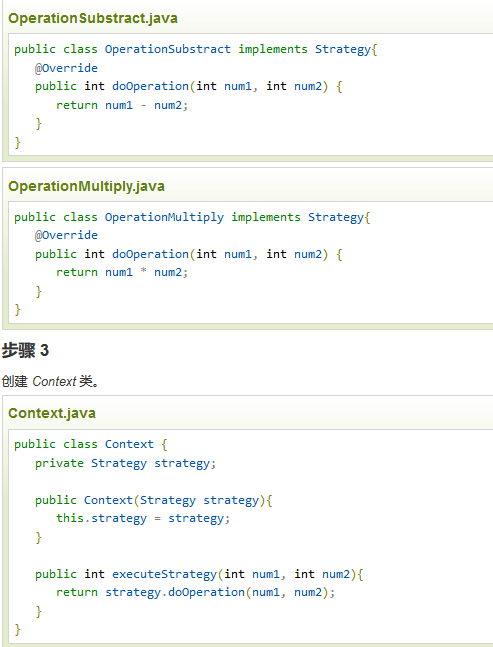  
* 模板方法模式：父类定义抽象函数，定义的逻辑骨架中调用抽象函数，实质是调用子类的实现。
* 观察者模式：监听模式，将自己加入到其他对象的监听列表中，执行自己的更新函数，回调方式
* 迭代器模式：实现迭代遍历Iterator
* 责任链模式：为请求创建了一个接收者对象的链。这种模式给予请求的类型，对请求的发送者和接收者进行解耦。如果不能处理交个下一个处理者。  
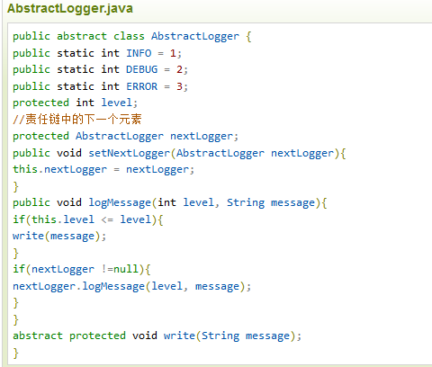  
* 命令模式：请求以命令的形式包裹在对象中，并传给调用对象。线程池worker用到的模式  
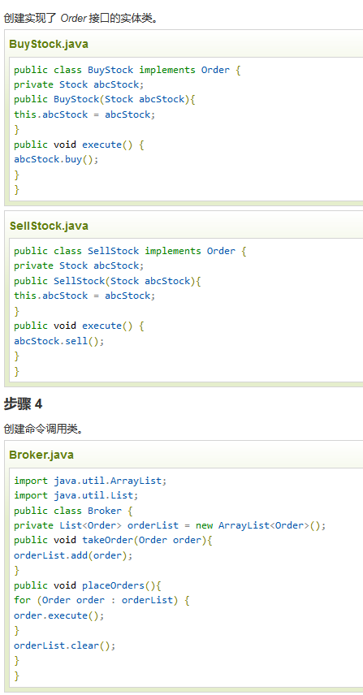  
* 备忘录模式：保存一个对象的某个状态，以便在适当的时候恢复对象。  
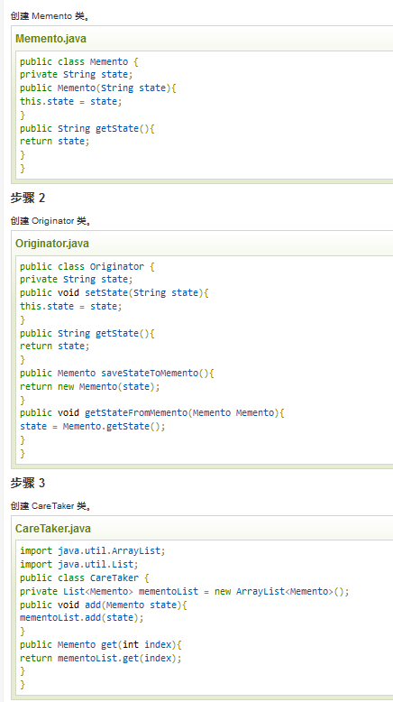  
* 状态模式：代码中包含大量与对象状态有关的条件语句，将各种具体的状态类抽象出来，状态类反向修改实际类的状态  
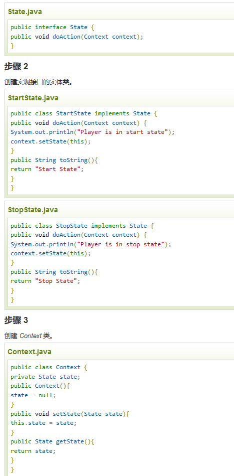  
* 访问者模式：需要对一个对象结构中的对象进行很多不同的并且不相关的操作，而需要避免让这些操作"污染"这些对象的类，使用访问者模式将这些封装到类中，在被访问的类里面加一个对外提供接待访问者的接口  
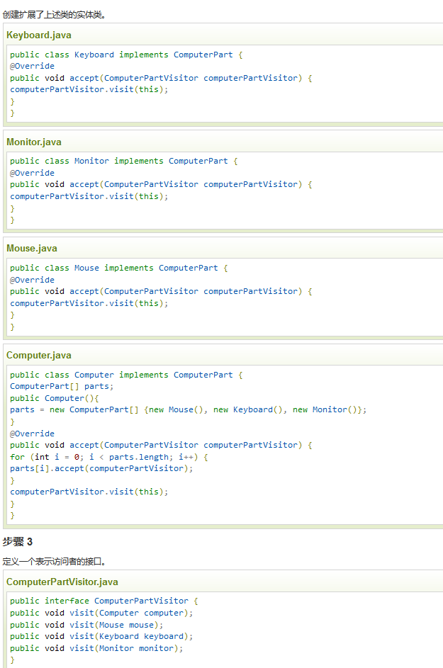  
* 中介者模式：用一个中介对象来封装一系列的对象交互，中介者使各对象不需要显式地相互引用，从而使其耦合松散，而且可以独立地改变它们之间的交互。  
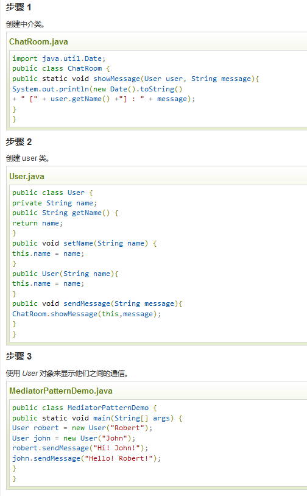 
* 解释器模式：给定一个语言，定义它的文法表示，并定义一个解释器，这个解释器使用该标识来解释语言中的句子，正则表达式模式  
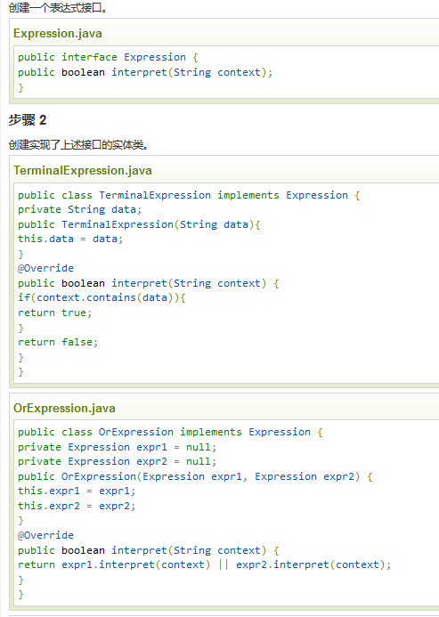 
