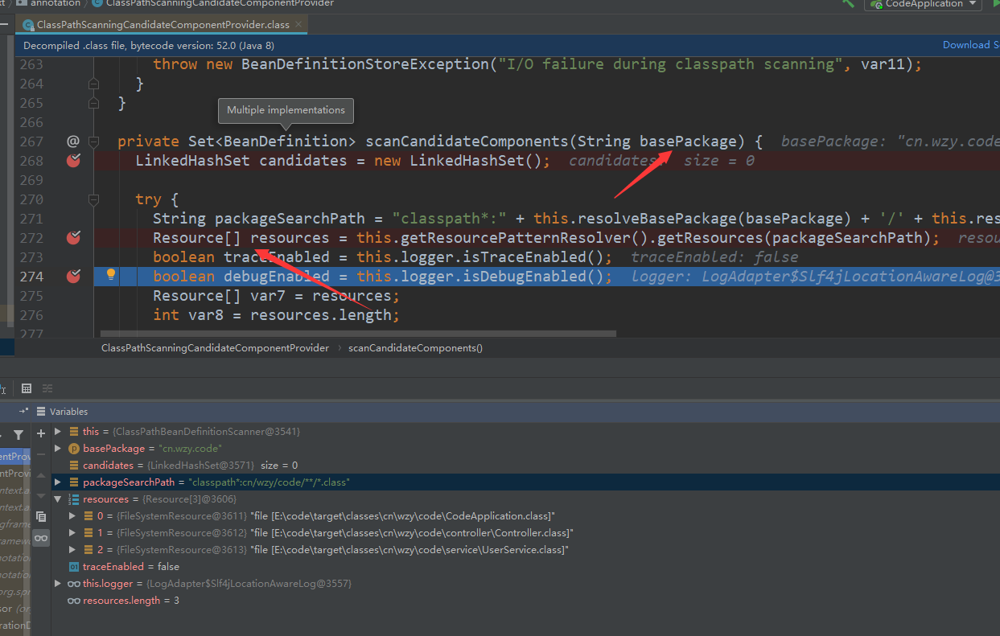

## spring-boot 启动解析
* beanFactory：bean容器
* StopWatch：监测各项初始化工作的耗時情況
* ConfigurableApplicationContext：配置式spring应用上下文
* BeanFactoryPostProcessor：后置处理器,刷新及注册beans进应用上下文
* ConfigurationClass：配置式的bean,相当于一个bean.xml
* ConfigurationClassParser：ConfigurationClass的解析器,负责解析
* ComponentScanAnnotationParser：扫描配置页面，为ClassPathScanningCandidateComponentProvider提供扫描位置
* ClassPathScanningCandidateComponentProvider：具体扫描bean的类,需要basePackage路劲参数

加载流程：  
* SpringApplication的run方法会初始化一个ConfigurableApplicationContext，这个应用上下文内部有一个BeanFactory，包含Spring的bean。接下来的注册bean的流程大多数是对beanFactory的操作。
* 注册bean之前会对beanFactory添加BeanPostProcessor（后置处理器）。
* 对后置处理器分类，分成BeanDefinitionRegistryPostProcessor，其他常规后置处理器
* 执行BeanDefinitionRegistryPostProcessor典型的是ConfigurationClassPostProcessor
* ConfigurationClassPostProcessor首先从容器中拿出像@Configuration类似的配置类
* ConfigurationClassPostProcessor有个属性叫ConfigurationClassParser去解析Configuration类
* ConfigurationClassParser委托ComponentScanAnnotationParser去扫描bean
* ComponentScanAnnotationParser如果没有具体的扫描包，会以@Configuration类的包名为扫描包
* ComponentScanAnnotationParser委托ResourcePatternResolver路径解析器去检索所有匹配的class，返回Resource对象（FileSystemResource）
* ComponentScanAnnotationParser将Resource对象读取成ClassMetadata（bean的元数据，描述bean的物理位置信息，比如路径，类名）
* ComponentScanAnnotationParser接着解析成BeanDefinition（bean在spring中的储存形式，核心信息：类名、MutablePropertyValues包含了List<键值>的所有属性）
将解析出来的beanDefinition注册进beanFactory中完成bean注册  
  

获取bean流程：
* ConfigurableApplicationContext内部有一个BeanFactory，调用getBean委托内部BeanFactory去获取
* 如果是单例就查看全局单例Map里是否有这个实例，如果有就返回
* 没有实例，获取BeanDefinition
* 生成BeanWrapper（生成出基本类，未进行依赖注入），如果是单例同时注册进factory中
* 调用populateBean方法（进行依赖注入）
    * 取出BeanPostProcessor,依次执行关于依赖注入的后置处理器
    * AutowiredAnnotationBeanPostProcessor(核心后置处理器)解析出需要注入参数的属性InjectionMetadata
    * 通过BeanFactory的resolveDependency获取出属性的value
    * 利用反射修改目标对象的属性值
* 调用initializeBean初始化bean
    * 如果配置有aop的advice，创建代理对象替换当前bean
* 返回bean
## AOP解析
每个advice都是一个bean注册到spring中，aop代理过程是在获取bean的时候产生的  
过程：
* 上一步骤：生成bean，populateBean进行依赖注入
* 初始化：依次调用BeanPostProcessor
    * 其中有一个AbstractAutoProxyCreator生成代理类
* getAdvicesAndAdvisorsForBean获取相关的Object[] specificInterceptors拦截器
* createProxy生成代理类
    * 如果是有接口，采用jdk代理，创建代理对象，在自定义的InvocationHandler中写好调用advisor调用链条逻辑
    * 没有接口采用cglib代理，继承目的类，设置回调处理函数MethodInterceptor,在其中调用advisor调用链条逻辑
* 返回代理类
## spring框架的理解
* IOC和DI的原理和源码分析
* AOP的实现原理  
    * jdk动态代理  
    动态生成代理类，然后加载到jvm中
    * CGLIB动态代理
    继承需要代理的对象，所以只能代理可重写方法（不能代理final，以及private方法）
* 事务的实现、传播行为
* spring管理的bean的模式，默认单例
* spring如何管理bean、bean的生命周期
## springMvc的理解
* 接口地址和方法的映射过程
* @ResponseBody的处理
* @RequestMapping的处理
[spring框架的学习](https://github.com/1510460325/springframework/blob/master/README.md)
## Mybatis
* sql语句和方法的映射原理
* \#{} 和 \${}的区别  
\#{}会把参数部分用一个占位符 ? 代替，可防止sql攻击  
\${}在预编译的时候会直接替换
### 拦截器、过滤器
过滤器使用场景：过滤字符集  
拦截器使用场景：实现权限验证，日志记录  
Filter需要在web.xml中配置，依赖于Servlet；  
Interceptor需要在SpringMVC中配置，依赖于框架，基于java反射的AOP思想；  
所以Filter比Interceptor先执行  