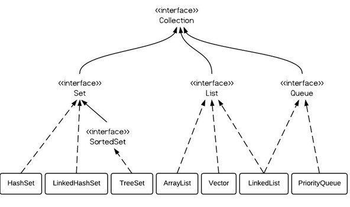

## Java基础： 
### 内存泄露、内存溢出
* 内存泄露：内存泄漏是指无用对象（不再使用的对象）持续占有内存或无用对象的内存得不到及时释放，从而造成内存空间的浪费称为内存泄漏。
长生命周期的对象持有短生命周期对象的引用就很可能发生内存泄漏，尽管短生命周期对象已经不再需要，但是因为长生命周期持有它的引用而导致不能被回收，这就是Java中内存泄漏的发生场景。  
ThreadLocal变量没有及时remove会造成内存泄露.
* 内存溢出：内存中加载的数据量过于庞大，如一次从数据库取出过多数据，导致堆内存分配不下。
### 函数重载、重写
***重载***：发生在同一个类中，方法名必须相同，参数类型不同、个数不同、顺序不同，方法返回值和访问修饰符可以不同，不能只有函数返回值类型不同  
***重写***：发生在父子类中，方法名、参数列表必须相同，返回值范围小于等于父类，抛出的异常范围小于等于父类，访问修饰符范围大于等于父类；如果父类方法访问修饰符为 private 则子类就不能重写该方法。
### 什么是泛型？
泛型是一种参数化类型，它的<>里面可以放任何类型，而且不要强转，它是多态的一种体现。
### Java中是否可以覆盖(override)一个private或者是static的方法？
* private: 父类对子类不可见，相当于是新添一个方法，不冲突，并不算是覆盖
* static：父类的static方法是在父类层次上，两个不冲突，就看引用是什么类型了，如果是父类则调用父类方法，如果是子类就调用子类方法
~~~
public class Base {
	private Base next;
	static void say(){
		System.out.println("base");
	}
}
public class Child extends Base {
	private Base next;
	static void say(){
		System.out.println("child");
	}
}
public class Main {
	public static void main(String[] args) {
		Child child = new Child();
		((Base)child).say();//bases
		(child).say();//child
	}
}
~~~
同时不可见的成员变量也是可以的。
### 定义一个空参数的构造方法的作用
Java 程序在执行子类的构造方法之前，如果没有用 super() 来调用父类特定的构造方法，则会调用父类中“没有参数的构造方法”。因此，如果父类中只定义了有参数的构造方法，而在子类的构造方法中又没有用 super() 来调用父类中特定的构造方法，则编译时将发生错误，因为 Java 程序在父类中找不到没有参数的构造方法可供执行。解决办法是在父类里加上一个不做事且没有参数的构造方法。 
### 集合容器以及底层实现原理  
  
  
* ArrayList、Vector（线程安全）底层数组实现，使用数据的移动位置来增删元素  
* Stack继承vector，加在最后，弹出最后  
* queue队列先进先出
* HashMap  
计算方法：hashcode和本身右移16位的异或运算,再用结果与数组大小&运算得到最终到达的槽位  
***数组大小设置为2的n次幂***：这样 n - 1 全为每位全为1，&的结果就冲突小
如果这个槽位中节点的个数多于8个，那么将这个槽位的链表转换成红黑树 
* HashSet  
内部有一个HashMap，只是每次put同一个value占位  
* LinkedHashMap  
重写newNode方法：新建节点是继承map的节点，多了前后的指针属性  
在新建节点的时候把此节点连接到链表后面  
***访问顺序排序***：accessOrder设置为true按照访问顺序输出，最近访问的会换到链尾  
* LinkedHashSet  
初始化一个LinkedHashMap，跟HashSet一样存储  
* TreeMap  
红黑树存储节点  
* TreeSet  
内部有一个TreeMap
* Collections.sort底层排序方式  
排序方式为Timsort：将数组划分为若干的升序降序区间（run）入栈，最后将栈不断融合直至一个元素。
### 哪些是线程安全的集合
* 列表：
    * vector：所有操作加锁
    * stack：继承vector
    * CopyOnWriteArrayList：操作副本
    * ArrayBlockingQueue：阻塞队列
* map：
    * hashtable：所有操作加锁
    * ConcurrentHashMap：分段锁
* Set：
    * CopyOnWriteArraySet：内部有一个CopyOnWriteArrayList
### String类相关知识点
* 存储方式  
new String("abc")数据存到堆内存  
String a = "abc";字符串是存到方法区  
* 正则表达式
### 初始化顺序的执行顺序
1先类层次的，父类到子类的所有类层次的初始化完毕；    
2再执行父类到子类的所有实例层次上的初始化；  
3先执行初始化块，再执行构造函数  
### 接口和类的理解
* 抽象类是 is a; 接口是 has a：使用抽象类主要是为了抽象子类可共用的数据和行为，待子类派生时减少重复代码。类实现某个接口更像是给这个类打了一个标签，表明这个类的实例符合某种标准，获得了某种能力。  
* 接口的方法默认是 public，所有方法在接口中不能有实现(Java 8 开始接口方法可以有默认实现），抽象类可以有非抽象的方法
* 接口中的实例变量默认是 final 类型的，而抽象类中则不一定
* 一个类可以实现多个接口，但最多只能实现一个抽象类
* 一个类实现接口的话要实现接口的所有方法，而抽象类不一定
* 接口不能用 new 实例化，但可以声明，但是必须引用一个实现该接口的对象 从设计层面来说，抽象是对类的抽象，是一种模板设计，接口是行为的抽象，是一种行为的规范。
### 反射机制和内省机制  
反射机制运行时获取class参数，变量之类的  
内省机制获取变量的getter&setter方法  
### java的序列化  
将实例对象（内存对象）保存到磁盘静态对象字节序列，可以用于网络传输实例对象。  
可序列化类的所有子类都是可序列化的。
~~~
public class Main implements Serializable{
	static class Child extends Main{
		int code;
	}
	int id;
	public static void main(String[] args) throws IOException, ClassNotFoundException {
		ObjectOutput output = new ObjectOutputStream(new FileOutputStream("./out.txt"));
		Child main = new Child();
		main.code = 1555;
		main.id = 1555;
		output.writeObject(main);
		output.flush();
		output.close();
		ObjectInputStream input = new ObjectInputStream(new FileInputStream("./out.txt"));
		Child main1 = (Child) input.readObject();
		System.out.println(main1.code);//1555
	}
}

~~~
### 伪共享问题
计算机CPU和内存之间会有缓存（一级、二级、三级），当多核CPU访问三级缓存的时候，缓存是以行为单位缓存数据，
比如有一个数组，当CPU取第一个数据的时候，三级缓存会多存几个相邻数据（凑满一行），
但是当多个CPU访问同一行的不同数据的时候，也会引起这行缓存的同步操作，造成伪共享（不是真正的共享）。  
解决伪共享问题，多个线程的访问如果可以分开，那么尽量分更开，即采用占位让相邻的不共享数据分开。
### Java 中的异常处理
  
***Error（错误）***:是程序无法处理的错误，表示运行应用程序中较严重问题。大多数错误与代码编写者执行的操作无关，而表示代码运行时 JVM（Java 虚拟机）出现的问题。例如，Java虚拟机运行错误（Virtual MachineError），当 JVM 不再有继续执行操作所需的内存资源时，将出现 OutOfMemoryError。这些异常发生时，Java虚拟机（JVM）一般会选择线程终止。  
***Exception（异常）***:是程序本身可以处理的异常。Exception 类有一个重要的子类 RuntimeException。RuntimeException 异常由Java虚拟机抛出。NullPointerException（要访问的变量没有引用任何对象时，抛出该异常）、ArithmeticException（算术运算异常，一个整数除以0时，抛出该异常）和 ArrayIndexOutOfBoundsException （下标越界异常）。  
***注意***：异常和错误的区别：异常能被程序本身可以处理，错误是无法处理。
* try 块：用于捕获异常。其后可接零个或多个catch块，如果没有catch块，则必须跟一个finally块。
* catch 块：用于处理try捕获到的异常。
* finally 块：无论是否捕获或处理异常，finally块里的语句都会被执行。当在try块或catch块中遇到return语句时，finally语句块将在方法返回之前被执行。
### 引用
* 强引用：new Object()，引用的目标永远不会被GC
* 软引用：jvm在内存溢出之前才会清理掉这块内存
* 弱引用：存活一个GC期间，下次gc回收
* 虚引用：在gc回收的时候收到一个系统通知
### switch只能用int和枚举，String
* swtich（）里面必须是int和enum--即枚举类型。 short、 char 或者 byte他会自动转换为int， long不能自动转换为int..
* String可以看成枚举类型
### 编译型语言与解释型语言
* 编译型语言：有编译过程的语言，将代码编译成机器码，如c/c++
* 解释型语言：程序代码是运行过程中翻译成机器语言，java是jvm动态翻译的
### Comparator 和 Comparable接口
* Comparator：可以比较两个对象，相当于一个裁判的职责
* Comparable：可以与别人比较，相当于一个选手
### 死锁、活锁
* 死锁: 两个或多个线程相互等待对方释放锁，则会出现死锁现象。
* 活锁: 任务或者执行者没有被阻塞，由于某些条件没有满足，导致一直重复尝试，失败，尝试，失败。