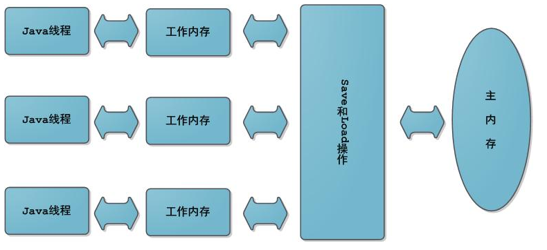
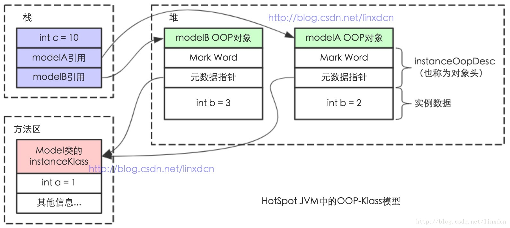
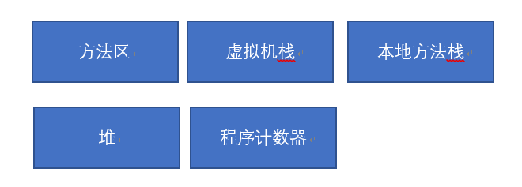
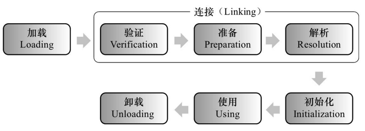
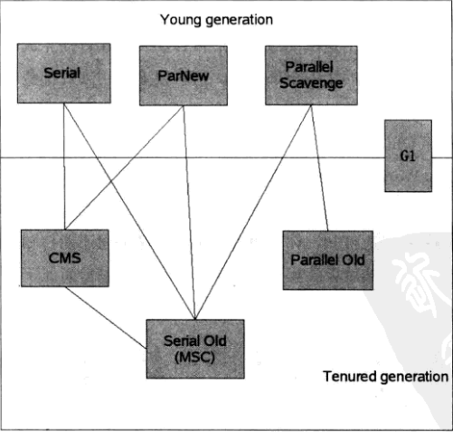
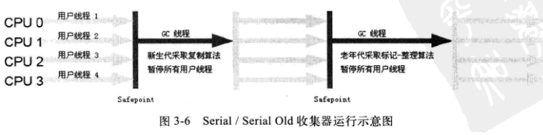
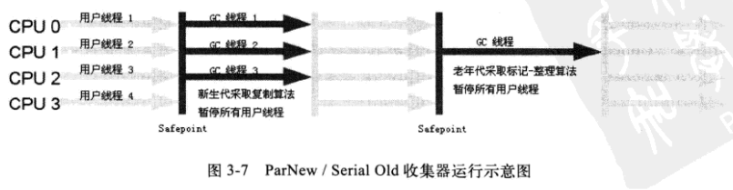
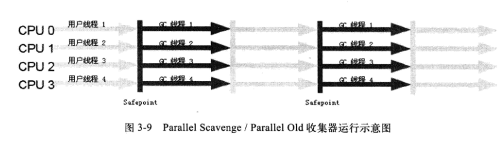
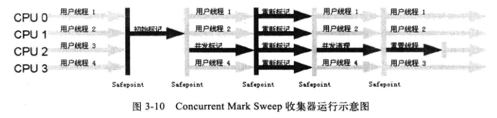

## JVM相关知识点
### java内存模型：工作内存和主内存
Java内存模型中规定了所有的变量都存储在主内存中，每条线程还有自己的工作内存（可以与前面将的处理器的高速缓存类比），线程的工作内存中保存了该线程使用到的变量到主内存副本拷贝，线程对变量的所有操作（读取、赋值）都必须在工作内存中进行，而不能直接读写主内存中的变量。不同线程之间无法直接访问对方工作内存中的变量，线程间变量值的传递均需要在主内存来完成，线程、主内存和工作内存的交互关系如下图所示。

### java对象存储模型
每一个Java类，在被JVM加载的时候，JVM会给这个类创建一个instanceKlass，保存在方法区，用来在JVM层表示该Java类。当我们在Java代码中，使用new创建一个对象的时候，JVM会创建一个instanceOopDesc对象，这个对象中包含了对象头以及实例数据。  

### java内存结构及各个区域的作用

* 程序计数器：存储各个线程的指令进行的行号（线程私有）  
* 虚拟机栈：存储各个线程的运行时的局部变量表（对象引用）、操作数栈、方法出口等信息 
* 本地方法栈：和虚拟机栈类似，区别存储执行本地方法的栈
* java堆：主要的内存区域，为创建的对象分配内存
* 方法区：存储加载的的类信息、常量、静态变量  
***运行时常量池*** ：存放编译时期的字面常量，位于方法区，String的intern方法会添加到常量池  
### 什么时候触发哪种类别的GC
Minor GC 的触发条件：大多数情况下，直接在 Eden 区中进行分配。如果 Eden区域没有足够的空间，那么就会发起一次 Minor GC  
对于 Full GC（Major GC）的触发条件：
* 也是如果老年代没有足够空间的话，那么就会进行一次 Full GC。
* System.gc方法会触发一次full GC  
### GC的算法
* 新生代（堆）：创建对象创建在这里，gc常常发生
* 老年代（堆）：新生代的对象存活时间长的会转入到老年代，或者新生代存不下新建对象
* 永久代（方法区）：加载类的时候存储类型信息，一般不会gc  

***算法***：
* 标记-清除：产生大量离散碎片
* 复制算法：三个区域eden（大）+2*survivor（小）；每次在eden新建对象，gc的时候复制到另外一个survivor中，清除以前的两个区域。
* 标记-整理：压缩可用区域，将可用对象挤在一起
### 类加载机制
* 类加载器：负责读取Java字节码，并转换成java.lang.Class类的一个实例；
* 双亲委派模式：所谓双亲委派是指每次收到类加载请求时，先将请求委派给父类加载器完成（所有加载请求最终会委派到顶层的Bootstrap ClassLoader加载器中），如果父类加载器无法完成这个加载（该加载器的搜索范围中没有找到对应的类），子类尝试自己加载。  
***双亲委派模式好处***：避免同一个类被多次加载；每个加载器只能加载自己范围内的类；
### 类加载过程：

* 加载：将class字节码加载进jvm，转换为java.lang.Class对象
* 验证：验证阶段主要包括四个检验过程：文件格式验证、元数据验证、字节码验证和符号引用验证;
* 准备：为类中的所有静态变量分配内存空间，并为其设置一个初始值（由于还没有产生对象，实例变量将不再此操作范围内）；
* 解析：将常量池中所有的符号引用转为直接引用（得到类或者字段、方法在内存中的指针或者偏移量，以便直接调用该方法）。这个阶段可以在初始化之后再执行。
* 初始化：在new的阶段执行编写的初始化逻辑
* 使用：使用对象
* 卸载：关闭jvm的时候
### JVM GC算法和垃圾收集器
***算法***：
* 标记-清除：产生大量离散碎片
* 复制算法：三个区域eden（大）+2*survivor（小）；每次在eden新建对象，gc的时候复制到另外一个survivor中，清除以前的两个区域。
* 标记-整理：压缩可用区域，将可用对象挤在一起  

***垃圾收集器***：  

* Serial 收集器（新生代）：单线程阻塞所有用户进程，采用复制算法清理新生代
* Serial Old 收集器（老年代）：Serial的老年代收集版本，采用标记整理算法

* ParNew 收集器（新生代）：Serial的多线程版本，采用多线程复制算法
* Parallel Scavenge 收集器（新生代）：和ParNew类似，更专注于提高吞吐量（=运行代码时间/运行代码时间+GC时间），自适应调节各个区域的比例、晋升老年代对象大小，达到一个更高的吞吐量

* Parallel Old收集器（老年代）：于Parallel Scavenge配合，多线程标记整理算法回收老年代

* CMS收集器（Concurrent Mark Sweep）（老年代）：多线程标记清除算法。  
步骤：  
    * 初始标记：标记GC ROOT直接关联对象
    * 并发标记：从GC ROOT一路往下标记
    * 重新标记：标记用户程序变化的那一部分
    * 并发清理：清理无效对象

* G1 收集器（整个堆）：将堆内存划分成很多的大小相等的独立区域，然后标记之后对每个区域的回收价值大小排序，优先从价值大的区域开始回收。
将需要回收的区域存活对象复制到其他不需要回收的区域中。  
步骤：（每个区域有一个数据结构保存该区域的标记对象集合）
    * 初始标记：标记GC ROOT直接关联对象
    * 并发标记：从GC ROOT一路往下标记
    * 最终标记：将二次标记的结果加进本区域的标记集合中
    * 筛选回收：筛选价值最大的区域开始回收