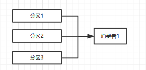
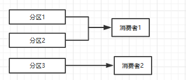
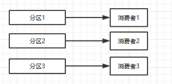
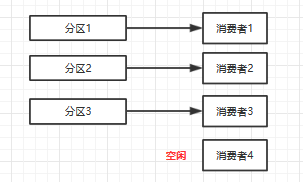

## Kafka
### Kafka概述、功能、场景
#### 概述
Apache Kafka是由Apache开发的一种发布订阅消息系统，它是一个分布式的、分区的和重复的日志服务。  
#### 功能
* 快速:单一的Kafka代理可以处理成千上万的客户端，每秒处理数兆字节的读写操作。
* 可伸缩:在一组机器上对数据进行分区和简化，以支持更大的数据
* 持久:消息是持久性的，并在集群中进行复制，以防止数据丢失。
* 容错：容错保证和持久性
* 容量：消息最大为1000000字节（将近1M）
#### 使用场景
* 任务队列：在生产者消费者模式下充当消息队列提高系统吞吐量
* 负载均衡：提供多工作服务器负载均衡
* 解耦业务：将各个模块解耦开来，利用消息系统通信
* 异步通信：用户不想也不需要立即处理消息。消息队列提供了异步处理机制，允许用户把一个消息放入队列，但并不立即处理它。
### broker及其作用
一个单独的kafka server就是一个broker，broker主要工作就是接收生产者发过来的消息，分配offset，之后保存到磁盘中。
同时，接收消费者、其他broker的请求，根据请求类型进行相应的处理并返回响应，比如将消息分给消费者，然后消费指针后移，
在一般的生产环境中，一个broker独占一台物理服务器
### 控制器Controller
在Kafka集群中会有一个或者多个broker，控制器（Kafka Controller）为其中的一个broker。  
职责：
* 管理每个分区的副本
* 负责分区选举首领
* 维护分区的ISR集合，当变化的时候更新数据元信息

选举Controller的算法：所有broker往zookeeper创建临时节点/controller，创建成功的为控制器，失败的是普通broker
### ISR
分区的同步副本集合，集合中的副本才是同步的、才有下次选举成首领副本的资格。
kafka在zookeeper中（/brokers/.../state）动态维护了一个ISR（in-sync replicas）
### 发送消息流程
1. producer 先从 zookeeper 的 "/brokers/.../state" 节点找到该 partition 的 leader
2. producer 将消息发送给该 leader
3. leader 将消息写入本地 log
4. followers 从 leader pull 消息，写入本地 log 后 leader 发送 ACK
5. leader 收到所有 ISR 中的 replica 的 ACK 后，增加 HW（high watermark，最后 commit 的 offset） 并向 producer 发送 ACK

注意：只提交ISR中最低offset那个，以后的消息是不会被消费的
### 消费者
每个topic的一个分区只能由相同消费组的一个消费者消费，消费组之间互不影响，也就是所有消费组都同等订阅这个消息，是一视同仁的  
例子（单个消费组）：
* 3个分区，1个消费者：  

* 3个分区，2个消费者：  

* 3个分区，3个消费者：  

* 3个分区，4个消费者：  
