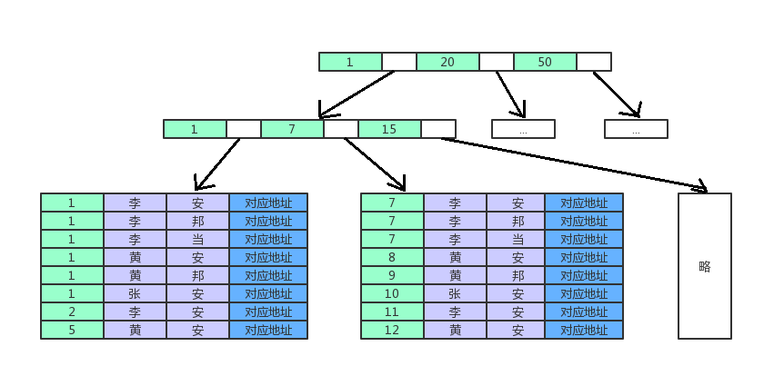

## mysql（InnoDB）
### 1 数据库ACID
* 原子性（Atomicity）
* 一致性（Consistency）
* 隔离性（Isolation）
* 持久性（Durability）
### 2 事务的隔离级别
事务隔离级别  |  脏读  |  不可重复读  |  幻读
---- | ----- | ------ | -----
读未提交（read-uncommitted）| 	是 |	是 |	是
不可重复读（read-committed）默认 | 	否| 	是 |	是
可重复读（repeatable-read） |	否 |	否 |	是
串行化（serializable） 	|否 |	否 |	否  

&emsp;&emsp;1、脏读：事务A读取了事务B更新的数据，然后B回滚操作，那么A读取到的数据是脏数据  
&emsp;&emsp;2、不可重复读：事务 A 多次读取同一数据，事务 B 在事务A多次读取的过程中，对数据作了更新并提交，导致事务A多次读取同一数据时，结果 不一致。  
&emsp;&emsp;3、幻读：系统管理员A将数据库中所有学生的成绩从具体分数改为ABCDE等级，但是系统管理员B就在这个时候插入了一条具体分数的记录，当系统管理员A改结束后发现还有一条记录没有改过来，就好像发生了幻觉一样，这就叫幻读。   
### 3 事务的传播行为
事务传播行为类型 | 说明
----- | -----
PROPAGATION_REQUIRED(默认情况下) |	如果当前没有事务，就新建一个事务，如果已经存在一个事务中，加入到这个事务中。这是最常见的选择。
PROPAGATION_SUPPORTS |	支持当前事务，如果当前没有事务，就以非事务方式执行。
PROPAGATION_MANDATORY |	使用当前的事务，如果当前没有事务，就抛出异常。
PROPAGATION_REQUIRES_NEW |	新建事务，如果当前存在事务，把当前事务挂起。
PROPAGATION_NOT_SUPPORTED |	以非事务方式执行操作，如果当前存在事务，就把当前事务挂起。
PROPAGATION_NEVER |	以非事务方式执行，如果当前存在事务，则抛出异常。
PROPAGATION_NESTED |	如果当前存在事务，则在嵌套事务内执行。如果当前没有事务，则执行与PROPAGATION_REQUIRED类似的操作。
### 4 事务的实现原理

### 5 存储的物理结构和逻辑结构
* .frm文件：表的定义文件
* .idb文件：表的数据文件（数据、索引文件）
分成表空间、段、区、页（存放一批行记录）
每行记录存在一个回滚指针，指向以前的记录，当事务回滚的时候，那么这个记录将置为以前的记录
### 6 数据类型及其区别
* varchar和char的区别
* text和BLOB的区别

### 7 索引分类
* 主键：是一种特殊的唯一索引，不允许有空值。
* 唯一索引：索引列中的值必须是唯一的，但是允许为空值，
* 普通索引：MySQL中基本索引类型，没有什么限制，允许在定义索引的列中插入重复值和空值，纯粹为了查询数据更快一点。
* 复合索引：在表中的多个字段组合上创建的索引，只有在查询条件中使用了这些字段的左边字段时，索引才会被使用，使用组合索引时遵循最左前缀集合。
* 全文索引：全文索引，只有在MyISAM引擎上才能使用，只能在CHAR,VARCHAR,TEXT类型字段上使用全文索引

### 8 索引实现原理（B+树）
#### 8.1 B+树：  
1. 有k个子结点的结点必然有k个关键码
2. 非叶结点仅具有索引作用，跟记录有关的信息均存放在叶结点中
3. 树的所有叶结点构成一个有序链表，可以按照关键码排序的次序遍历全部记录  
#### 8.2 索引结构：
* ***聚集索引***  
一个表只能有一个聚集索引：由主键所建成的B+树构成  
* ***非聚集索引（辅助索引）***  
由每个索引建成的B+树，叶子节点保存的是记录的聚集索引键，也就是说每次通过非聚集索引查找相关记录的时候是查找两个B+树
（有些引擎是非聚集索引直接保存的是记录的磁盘位置，这样的话只需要查找一个B+树，但是记录如果有修改，那么会更新所有的相关聚集索引，
但是如果存放聚集索引键，那么只用更新聚集索引的B+树）  
#### 8.3 复合索引实现原理  
比如（列a，列b）的复合索引：  
建造一个列A的B+树，每个叶子节点存放所有的列a的数据，然后按照列b排序  
例：按照年龄、姓、名字排序  

### 自适应哈希  
InnoDB存储引擎自动创建一个哈希表，自动根据访问的频率和模式来为某些页建立哈希索引。 
