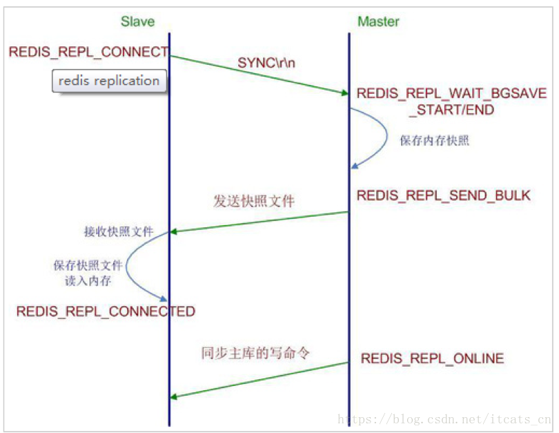
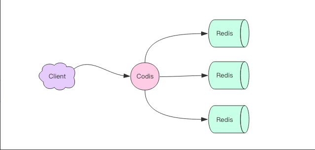
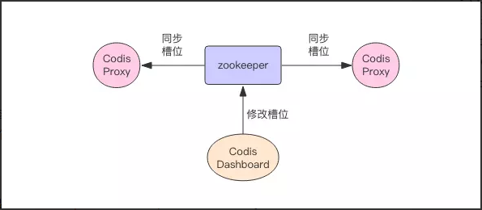
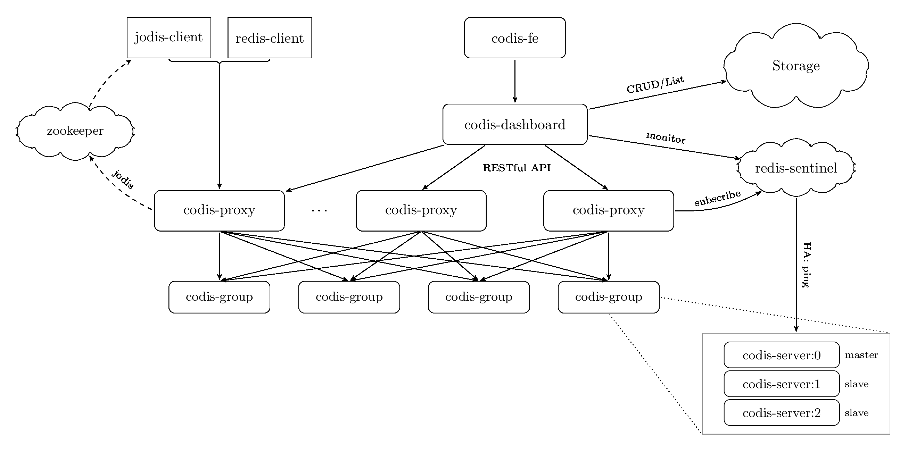

## redis知识点
### 5中数据结构(string, list, set, hash, zset)
* string： 字符串类型
* list：链表类型
* set：哈希表
* hash：字典（哈希表）
* zset：跳跃表实现
### redis持久化（RDB、AOF）
* RDB：把当前内存中的数据集快照写入磁盘，也就是 Snapshot 快照（数据库中所有键值对数据）。恢复时是将快照文件直接读到内存里。
* AOF：redis会将每一个收到的写命令都通过write函数追加到文件中(默认是 appendonly.aof)，当redis重启时会通过重新执行文件中保存的写命令来在内存中重建整个数据库的内容。
### redis内存回收机制：
* 引用计数法：回收引用数量为0的内存区域
* LRU：最久未使用的键优先回收
### zset的数据结构
跳跃表实现
### setnx实现分布式锁
加锁时只有一个线程能设置成功，其他线程设置失败自旋等待，解锁时删除该键。
### 相邻运行（不保证原子性）
jedis的事务，multi开启事务，最后执行操作。
### redis 主从复制
master不做任何配置，slave机器指定master  

* 同步：
    * 全量同步：从服务器主动请求主服务器，执行rbd操作，发回数据库快照，从服务器丢弃旧数据，载入新数据
    * 增量同步：全量同步之后，主服务器每执行一个写命令，就向从服务器发送执行新命令
### 哨兵机制 sentinel
* 监控(Monitoring): 哨兵(sentinel) 会不断地检查你的Master和Slave是否运作正常。
* 提醒(Notification):当被监控的某个Redis出现问题时, 哨兵(sentinel) 可以通过 API 向管理员或者其他应用程序发送通知。
* 自动故障迁移(Automatic failover):当一个Master不能正常工作时，哨兵(sentinel) 会开始一次自动故障迁移操作,它会将失效Master的其中一个Slave升级为新的Master, 并让失效Master的其他Slave改为复制新的Master; 当客户端试图连接失效的Master时,集群也会向客户端返回新Master的地址,使得集群可以使用Master代替失效Master。
### redis集群codis 大致实现原理
模型：  

* 分片：Codis会把所有的key分成1024个槽，这1024个槽对应着的就是Redis的集群，这个在Codis中是会在内存中维护着这1024个槽与Redis实例的映射关系。
~~~
//Codis中Key的算法
hash = crc32(command.key)
slot_index = hash % 1024
redis = slots[slot_index].redis
redis.do(command)
~~~
* Codis之间的槽位同步：基于zookeeper同步  

* 在迁移的时候，会在原来的Redis节点和新的Redis里都保存着迁移的槽位信息，在迁移的过程中，如果有key打进将要迁移或者正在迁移的旧槽位的时候，这个时候Codis的处理机制是，先是将这个key强制迁移到新的Redis节点中，然后再告诉Codis,下次如果有新的key的打在这个槽位中的话，那么转发到新的节点。
~~~
slot_index = crc32(command.key) % 1024
if slot_index in migrating_slots:
	do_migrate_key(command.key)  # 强制执行迁移
	redis = slots[slot_index].new_redis
else:
	redis = slots[slot_index].redis
redis.do(command)
~~~
* 容错机制：基于redis底层sentinel实现redis-server-group的自动切换  

## 《redis的设计与实现》读书笔记
redis主要结构及其底层实现： 
 
|数据结构|底层实现|
|:----:|:---:
string | SDS
list | listNode, ziplist
set | dict, intset, ziplist
hash| dict, ziplist
zset| 跳跃表，ziplist

### 1. SDS （simple dynamic string）简单动态字符串
~~~ c
struct sdshdr {
    int len; // 字符长度
    int free; // 空闲长度
    char buf[]; // 数据字符数组
};
~~~
相对于基本C语言字符串的优势：
* 获取长度的复杂度低
* 杜绝缓冲区的溢出、越界
* 减少修改字符串的内存重分配
* 二进制安全，可以存'\0'的二进制数据
* 兼容C字符串函数
### 2. 链表设计
数据结构：双向链表
~~~ c
typedef struct listNode {
	
	void *value;
	
	struct listNode *pre;
	
	struct listNode *next;
};

typedef struct node{
	
	listNode *head;
	
	listNode *tail;
	
	long len;
};
~~~
### 3. 字典设计
设计和HashMap类似，一个entry的数组，采用链地址法解决hash冲突
~~~ c
typedef struct dictEntry {
    void *keyl
    
    union {
        void *val;
        ......;
    }
    // 链地址法链接下一个节点
    struct dictEntry *next;
};

哈希表：
typedef struct dictht {
    dictEntry **table; // 节点数组
    
    long size; // 哈希表的长度
    
    long used; // 已存有节点数
};

typedef struct dict {
    dictht ht[2]; // 额外的一个空哈希表用于rehash的复制操作
};
~~~
rehash操作：
* 扩容或者缩容时，分配hr[1] 的内存
* 将ht[0] 中的所有entry重新计算移动到ht[1] 中
* ht[0] 和 ht[1] 指针交换，释放ht[1]

渐进式rehash：分步骤rehash每一个索引的数据，同时涉及到的增删改操作在两个哈希表中进行。
### 4. 跳跃表的设计，zset的实现
采用跳跃表数据结构：多层跨度指针
~~~ c
typedef struct zskiplistNode {
    struct zskiplistNode *backward; // 后退指针
    double score; // 分数
    robj *obj; // 取值
    struct zskiplistLevel {
        struct zskiplistNode *forward; // 下一个（前进指针）
        unsigned int span; // 跨度
    } level[];
};

typedef struct zskiplist {
    struct zskiplistNode *head, *tail;
    unsigned long lenth;
    int level;
};
~~~
### 5. 整数集合
当一个set集合中的元素全为整数的时候,redis会以整数集合来保存：
数组元素的升级操作灵活的升级元素编码，节约内存
~~~ c
typedef struct intset {
    uint32_t encoding; // 编码方式
    uint32_t length;
    int8_t contents[]; // 整数数组
};
~~~
### 6. 压缩列表
当一个列表键只包含少量（数据元素也是比较短小的）的列表，就会使用压缩列表来保存这些元素。
同时短小的hash键和zset键也会有所涉及
~~~
数据结构：
zlbytes zltail zlllen entry1 entry2 entry3 ... zlend
~~~
当保存到的hash键的键值对都比较短小的时候以ziplist保存，
奇数位置保存key，紧挨靠后的保存value
### 7. 对象
在redis的key->value中，key为字符串类型，value为redisObject对象：
~~~ c
typedef struct redisObject {
    unsigned type; // 类型
    unsigned encoding; // 底层编码格式
    void *ptr; // 目标对象的指针
    ....
    int refcount; // 引用次数
    int lru; // key最后被访问的时间，用于内存回收
};
~~~
### 8. 数据库服务Server
一个redis服务器中含多个数据库，结构为：
~~~ c
struct redisServer{
    redisDb **db; // 数据库数组
    int dbnum; // 数据库个数
};
~~~
### 9. 数据库DB
数据库中包含有所有的键值对以及所有的过期时间
~~~ c
struct redisDb{
    dict *dict; // 字典包含所有的键值对
    ...
    dict *expires; // 所有键的过期时间
};
~~~
### 9.1 过期删除策略
* ***定时删除***：设置键的过期时间的同时，创建一个定时器，在过期的时候立即删除该键
* ***惰性删除***：在获取键的时候查询是否过期，如果过期删除键，否则返回值
* ***定期删除***：每隔一段时间，遍历所有的键的过期时间，删除其中过期的键
### 9.2 过期策略对持久化或者复制的影响
* RDB：将数据库数据保存到RDB文件中的时候，程序会对数据库中的键进行检查，如果过期将不会保存到文件中
* AOF：在数据库删除一个过期键的时候，会在AOF文件中追加一条DEL命令
* 主从复制：从服务器不会删除过期键，主服务器在删除一个过期键的时候，向所有从服务器发送DEL命令执行删除操作