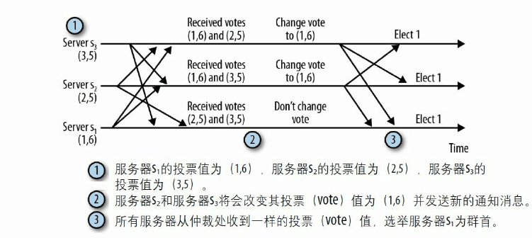

## zookeeper
### 监听机制
zookeeper客户端可以注册监听某个节点，然后在zookeeper中检测到节点变化的时候，那么会通知监听这个节点的客户端，
监听原理，客户端开启一个线程，监听某个端口，然后将监听事件（ip，port，path）发送到zookeeper的监听器列表，
zookeeper在节点该表的时候触发这个监听事件。
### 节点读写的原子性
节点的版本号随节点的更改而自增，当setData的时候，指定版本号如果不一样，那么修改不成功。
### 读写操作过程
* 读操作：客户端读取当前连接服务器的数据
* 写操作：follower发送请求到leader，leader封装成一个事务，标识符为zxid，然后leader将这个事务广播到所有的follower，
follower收到之后会应答，如果leader收到半数以上（n/2 + 1）的应答，确定这个事务能成功，那么不用所有的follower回应，
直接就再次广播，这个事务可以提交了，如果收不到半数以上，那么不提交，也就是这个操作不生效。
### 选举过程
每个事务的标识符为64位整数，32位时间戳（任期），32位的事务计数器（表示第几个事务）。
每个服务器发送投票信息（选举的服务器id，事务的最大id），开始的时候每个服务器投的都是自己，
也就是投票信息为（myId，myMax）,将投票信息发送到其他所有的服务器中，当收到其他服务器发来的投票信息，
就要和自己的投票信息做个取舍，取舍过程：
* 自己投票信息（1，5）
* 收到投票信息（2，6）
* 那么更新自己的投票为（2，6）

也就是说我原来选择自己为leader，现在有一个选票是2，他最大事务号为6，比自己大，那么我改变主意，选择2为leader啦，
如果对方的最大事务和自己的一样，那就选择一个服务器id大的为leader，（1，5）和（2，5）选择（2，5）。  
这样最终会产生一个结果，选如果一个服务器超过了仲裁人数（n/2 + 1）的推选，那么投票结束，就是这个服务器为leader，
其他就是follower。  

这个选举的目标就是选择信息尽可能多的机器为leader，如果信息一样多，那么为了一致，选择机器号大的。
### zookeeper实现分布式锁
非公平锁：临时节点/lock代表锁，存在代表上锁，不存在代表未上锁
同步线程创建/lock成功代表拥有锁，删除代表归还锁，如果不成功，那么监听这个节点的，如果删除再次请求创建。  
重入设计：创建锁节点数据为线程id+重入次数，再次申请锁的时候看线程id是否一致，如果一致，那么重入次数加1，归还锁的时候减1，
如果为0，释放锁。  
公平锁：创建一个/lock父节点，代表锁，创建一个子节点/lock/request-0001代表一个锁的申请，序号最小的得到锁，
所以请求锁的过程为创建一个子节点，列出/lock的子节点，看自己的序号是否是最小，如果是，那么得到锁往下执行，
如果不是，那么监听离自己最近序号节点，节点删除时通知自己执行。